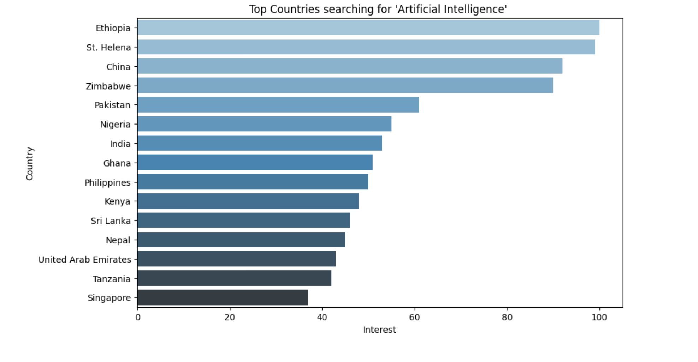
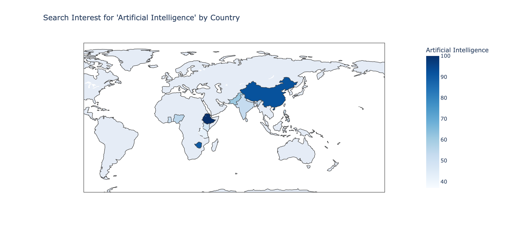
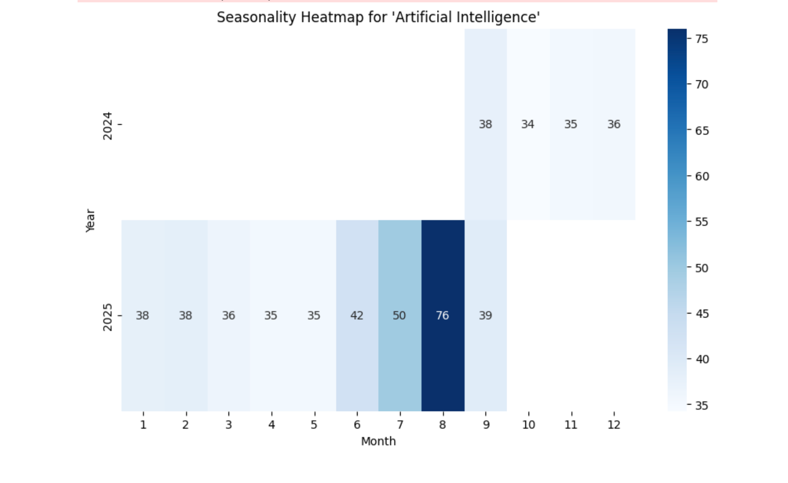
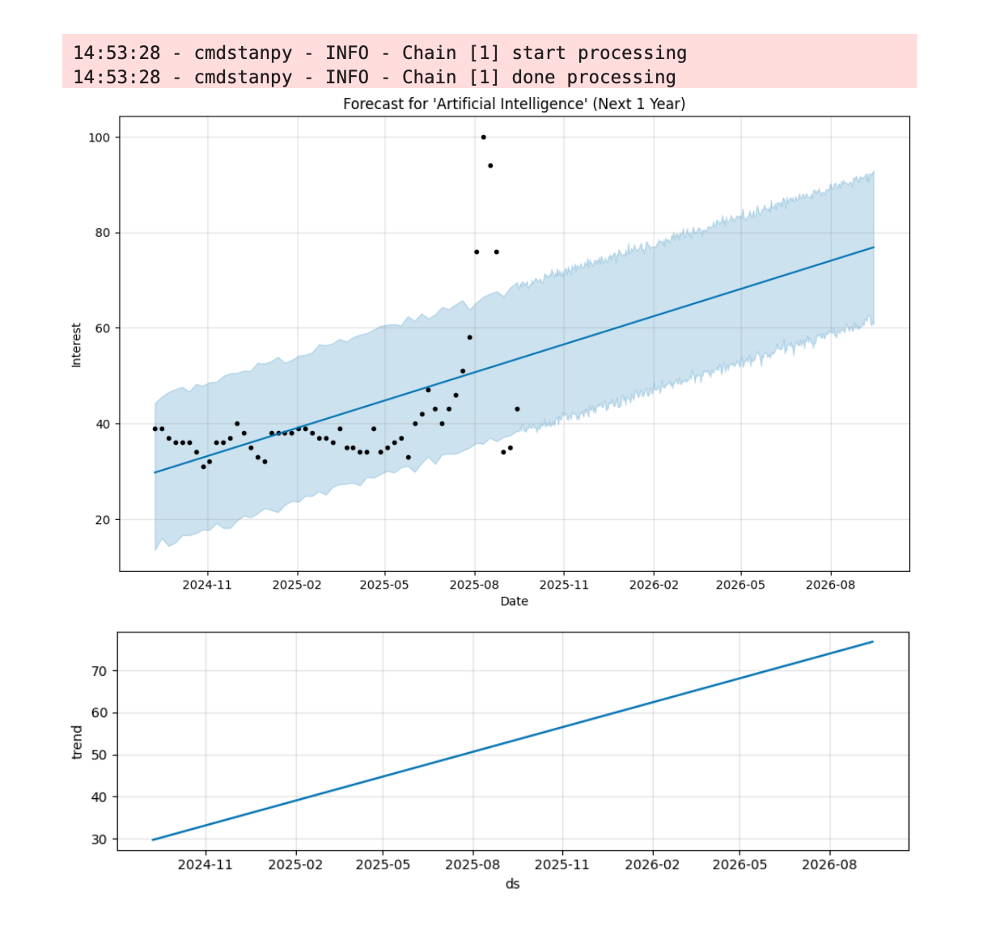
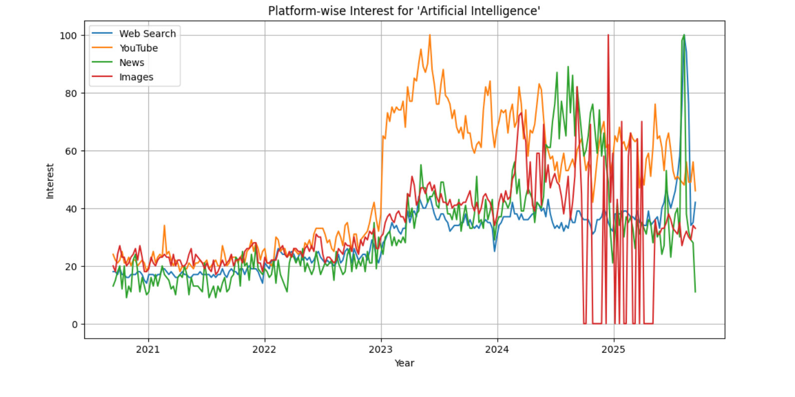

# DiSCALE – Google Trends Keyword Analysis

This project explores how people across the world search for different topics on **Google Trends**.  
It’s not just about plotting charts – it’s about turning search data into **real insights**:  
- Where is a keyword most popular?  
- How has it changed over time?  
- Does it follow a seasonal pattern?  
- Can we forecast its future interest?  
- How do related keywords compare?  

I built this project as part of my **data analytics learning journey** to practice collecting data, analyzing patterns, visualizing results, and building insights that could be valuable for businesses and researchers.  

---

## Features with Visuals

### Top 15 countries where the keyword is searched most

### Interactive world map of search interest

### Seasonality heatmap (month vs year patterns)

### Forecasting future search interest with Prophet

### Platform-wise analysis (Web, YouTube, News, Images)

---

## Tech Stack

- **Python** – Data analysis and visualization  
- **Pytrends** – Google Trends API wrapper  
- **Pandas** – Data processing  
- **Matplotlib & Seaborn** – Plots and heatmaps  
- **Plotly** – Interactive maps and charts  
- **Prophet** – Time-series forecasting  

---

## Example Insights

- *Artificial Intelligence* shows highest search popularity in tech-forward countries..  
- Yearly search interest shows steady growth over the last 5 years..  
- Seasonal patterns highlight recurring spikes in specific months..  
- Related terms like Machine Learning and Data Science show strong correlation.  
- Search behavior differs across Web vs YouTube vs News. 

---

## 📄 Report

The full project report is available here:  
📑 [Google_Trends_Analysis.pdf](Google_Trends_Analysis.pdf)

---

## Final Thoughts

This project shows how simple search data can reveal big insights about people and trends.  
It was a fun way to practice real-world analytics — from data collection to storytelling.  

If you liked this project, feel free to star the repo or connect with me!  

✍ *Made with curiosity and Python.*  

